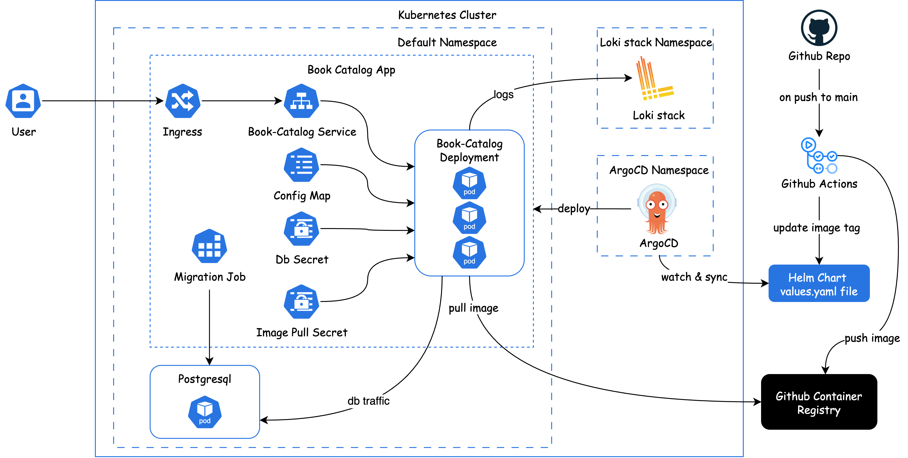

# Books Catalog Api

## Project Overview
Books Catalog API is a Django REST service for managing books via simple CRUD endpoints. It uses SQLite for local development and PostgreSQL in production, with structured request/response and error logging with correlation IDs to be searchable in Loki-Stack with Grafana. It is setup to deploy to local Kubernetes cluster with Helm. CI/CD pipeline is setup using Github action on pull request, and push on main branch to run tests, check migrations, build docker images with semantic release to push to ghcr registry and continuous deployment using ArgoCD.

Key implementation details
- **Runtime**: Python 3.12
- **Container**: Docker (with an `entrypoint.sh` that waits for DB, runs migrations, then starts the app)
- **Observability**: Structured JSON logs, request/response logging with correlation IDs, and internal server error logging. Correlation ID is injected via middleware for traceability for error logs.
- **Deployment**: Local Kubernetes cluster via Helm. Django app and PostgreSQL run in the `default` namespace, while Argo CD and Loki stack run in their own namespaces.
- **Database Migration**: Database migrations run automatically in two places:
  - On container start (for local testing)
  - As a Helm pre-install/pre-upgrade job 
- **Unit Test**: Used pytest for unit testing.

Project Structure
- `api/urls.py`: API routes
- `api/views.py`: Health + Book CRUD views
- `api/models.py`: `Book` model
- `api/serializers.py`: `Book` serializer
- `core/middleware/`: correlation ID and request/response logging
- `bookcatalog/settings.py`: config, DB selection by `DEVELOPMENT_ENV`, JSON logging format
- `helm-charts/`: Book-Catalog, Postgres, ArgoCD, and Loki values/templates
- `Dockerfile`, `docker-compose.yaml`, `entrypoint.sh`: containerization

## Api Endpoints
Api endpoints can be tested directly via the `test_endpoints/book.http` file.

Base path: `/api/`

Health
- **GET** `/api/` → 200 OK
  - Response: `{ "status": "ok", "running": true }`

Books
- **GET** `/api/books/` → 200 OK. List all books.
- **GET** `/api/books/{id}/` → 200 OK (or 404 if not found)
- **POST** `/api/books/` → 201 Created. Create a new book.
  - Body (JSON):
    - `isbn` (string, unique, required)
    - `title` (string, required)
    - `description` (string, optional; defaults to empty string)
    - `author` (string, required)
    - `published_date` (YYYY-MM-DD, required)
- **PUT** `/api/books/{id}/` → 200 OK. Replace entire resource.
- **PATCH** `/api/books/{id}/` → 200 OK. Partially update fields.
- **DELETE** `/api/books/{id}/` → 200 OK. Deletes the resource.

Example requests

```bash
# Health
curl -i http://localhost:8000/api/

# List books
curl -i -H 'Accept: application/json' http://localhost:8000/api/books/

# Create a book
curl -i -X POST http://localhost:8000/api/books/ \
  -H 'Content-Type: application/json' \
  -d '{
    "isbn": "44-444-444-444-44",
    "title": "Dummy Book",
    "description": "This is a dummy description",
    "author": "Swan",
    "published_date": "2025-07-31"
  }'

# Get by id
curl -i http://localhost:8000/api/books/1/

# Update (PUT)
curl -i -X PUT http://localhost:8000/api/books/1/ \
  -H 'Content-Type: application/json' \
  -d '{
    "isbn": "11-111-111-111-11",
    "title": "Dune 1",
    "description": "Only the best book ever. Let the spice flow",
    "author": "Frank Herbert",
    "published_date": "2025-05-25"
  }'

# Partial update (PATCH)
curl -i -X PATCH http://localhost:8000/api/books/1/ \
  -H 'Content-Type: application/json' \
  -d '{ "description": "Updated description" }'

# Delete
curl -i -X DELETE http://localhost:8000/api/books/1/
```

## How to locally build & run
1. Prerequisites: Python 3.12
2. Create and activate virtual environment
```bash
python3.12 -m venv .venv
source .venv/bin/activate
```
3. Install dependencies
```bash
pip install -r requirements.txt
```
4. Run the project directly or via docker compose
- Option A - Directly with SQLite Database
```bash
python manage.py migrate
python manage.py runserver
```
- Option B - Docker compose with Postgresql Database
```bash
docker compose up --build
```
Docker compose will:
- Build the image from the `Dockerfile` (Python 3.12-slim).
- Start PostgreSQL and the app with `DEVELOPMENT_ENV=false` so Django uses Postgres.
- The container entrypoint waits for DB, applies migrations, and then starts the server.

Run unit tests
```bash
pytest
```

Environment variables
- **DEVELOPMENT_ENV**: `true` uses SQLite. `false` uses Postgres. default value is `true`.
- **DATABASE_NAME**, **DATABASE_USER**, **DATABASE_PASSWORD**, **DATABASE_HOST**: only required when `DEVELOPMENT_ENV=false` for connecting postgresql database.

## CI/CD Setup
Pipeline (GitHub Actions)
- On pull requests targeting `main`:
  - Set up Python 3.12 and install dependencies
  - Run tests (`pytest`)
  - Run migrations against a test database
  - Verify no missing migrations (migration check)
- On merges to `main`:
  - Run all the above and wait for them to succeed
  - Create a semantic release tag (e.g. `1.1.2`) based on conventional commits and commit a changelog listing those commits
  - Build docker image using the tag created from semantic release and push image to GHCR registry
  - Update the latest tag in `helm-charts/envs/prod/values.yaml` file so that Argo CD can detect changes and deploy

## Kubernetes and Helm Setup
#### Charts
- **Book Catalog chart:** `helm-charts/book-catalog-chart`
  - Deployment `templates/deployment.yaml`: Deploying 3 container replicas on port `8000` (defined as `http`). Image is pulled from the repository defined in `values.yaml` file using image pull secret `ghcr-token` created as kubernetes secret resource. Containers are given resources defined in `values.yaml` file.
  - Service `templates/service.yaml`: ClusterIP Service on port `80` targeting container port `http` defined in deployment.
  - Ingress `templates/ingress.yaml`: route external traffic containing prefix /api to the Service on port 80.
  - Migration Job `templates/migration-job.yaml`: pre-install/pre-upgrade Job to run database migration.
  - Config Map `templates/configmap.yaml`: contains environment variables.
- **Postgres chart:** `helm-charts/postgres-helm`
- **ArgoCD chart:** `helm-charts/argocd-helm`
- **Loki stack chart:** `helm-charts/loki-stack-helm`

For specific values, please check `values.yaml` file in the desired helm chart folder.

#### Installation and Deployment
Sections for installation and deployment:
1. Django Application and Postgres Database
2. ArgoCD
3. Loki stack

Creating Kubernetes cluster
```bash
k3d cluster create books-cluster --port "8081:80@loadbalancer" --port "8443:443@loadbalancer" --port "30000-30010:30000-30010@server:0"
```
##### 1. Django Application and Postgres Database

1. Installing Postgres Helm chart
```bash
helm install books-database oci://registry-1.docker.io/bitnamicharts/postgresql -f ./postgres-helm/values.yaml
```
2. Creating image pull secret
```bash
kubectl create secret docker-registry ghcr-token \
    --docker-username=<your_github_username> \
    --docker-password=<your_token> \
    --docker-server=ghcr.io
```
3. Check secrets
```bash
kubectl get secrets
```
4. Check Book Catalog template
```bash
helm template books-api ./book-catalog-chart
```
5. Install Book Catalog chart
```bash
helm install books-api book-catalog-chart/.
```
6. See resources
```bash
kubectl get all
```
7. See migration pod logs
```bash
kubectl logs pod/<name of the migration pod>
```
8. Testing Postgres Database after migration
```bash
kubectl run books-database-postgresql-client --rm --tty -i --restart='Never' --namespace default --image docker.io/bitnami/postgresql:17.5.0-debian-12-r20 --env="PGPASSWORD=books" \
      --command -- psql --host books-database-postgresql -U books -d books -p 5432
```
```sql
SELECT *
FROM pg_catalog.pg_tables
WHERE schemaname != 'pg_catalog' AND
  schemaname != 'information_schema';
```

##### 2. ArgoCD
1. Add argo helm repo
```bash
helm repo add argo https://argoproj.github.io/argo-helm
helm repo update
```
2. Create namespace for argocd to deploy
```bash
kubectl create namespace argocd
```
3. Deploy argocd in its own namespace
```bash
helm -n argocd install argocd argo/argo-cd -f ./argocd-helm/values.yaml
```
4. Go to http://localhost:8081/argocd and will see login page. Use admin for username.
5. Get password for argocd
```bash
kubectl -n argocd get secret argocd-initial-admin-secret -o jsonpath="{.data.password}" | base64 -d
```
6. Connect repository
7. Create application
8. Update values files parameter to use `../envs/prod/values.yaml`

##### 3. Loki stack
1. Add grafana helm repo
```bash
helm repo add grafana https://grafana.github.io/helm-charts
helm repo update
```
2. Create namespace for loki stack
```bash
kubectl create namespace loki-stack
```
3. Deploy loki stack
```bash
helm upgrade --install loki-stack grafana/loki-stack --namespace=loki-stack -f ./loki-stack-helm/values.yaml
```
4. Get password for grafana ui
```bash
kubectl get secret --namespace loki-stack loki-stack-grafana -o jsonpath="{.data.admin-password}" | base64 --decode ; echo
```
5. Portforward to access grafana ui
```sh
kubectl port-forward --namespace loki-stack service/loki-stack-grafana 3000:80
```
6. Go to http://localhost:3000/ and will see login page.  Use admin for username.
7. Go to explore tab and query `{app="book-catalog-chart"}` to see logs 